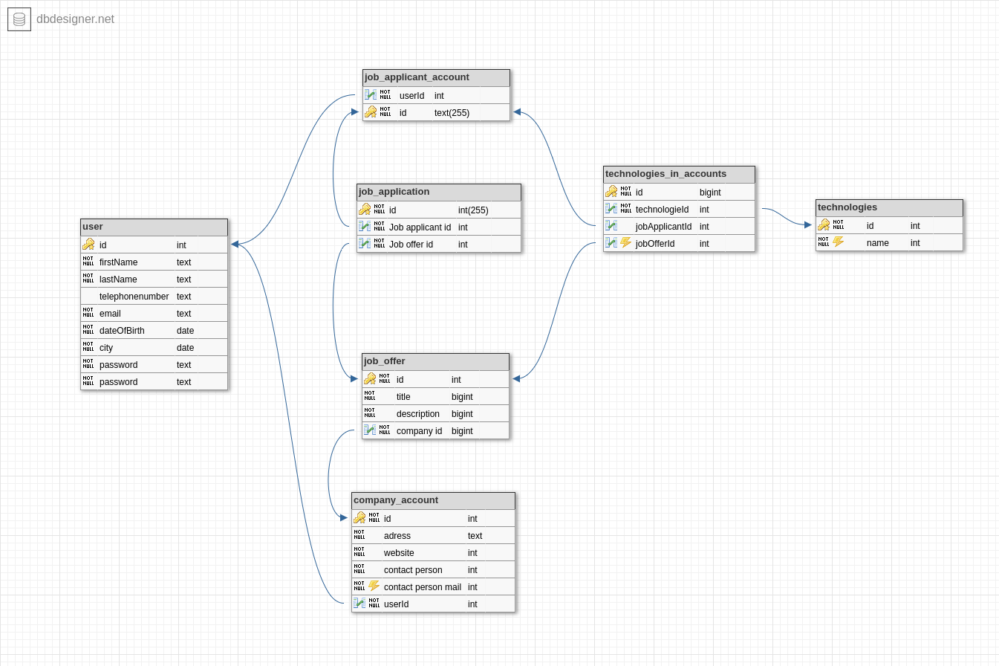

# codingworks-client

## Initial Description of Project.

Development of an app that matches a job offer with a job applicant.
The app should make it easy to find a job, just by swiping. You can swipe right to apply to a job. You can swipe left to deny a job offer.

## Brainstorm.

Here as an image of my initial brainstorm of the project. I used this brainstorm to make a start with the app.


## Usecases

### Usecases for Jobapplicant.

- As an user i want to be able to sign up.
- As an user i want to be able to setup my profile in easy way.
- As an user user i want to be able to edit my profile.
- As an user i want to be able to set some criteria's for a job i am looking for.
- As an user i want to be able to edit my profile.
- As an user i will be able to find a matching job offer in an easy way.

### Usecases for employer

- As an employer i want to be able to sign up in an easy way.
- As an employer i want to be able to edit my profile.
- As an employer i want to be able to post a job offer.
- As an employer i want to be able to find an matching employee based on requirements needed for the job.
- As an employer i want to be able to see which people reacted to my job offer.
- As an employer i want to be able to select some criteria that are important to my job offer.
- As an employer i want to be able to invite people for a job offer.

## Datamodel

### Datamodel version 1

In this picture you can see an inital drawing of the datamodel. It is a simple model, just to get starting. I.e.: I want a jobapplicant to be able to login.


### Datamodel version 2. 
This is the second version of the datamodel. 
* I want to be able to create a user so i added an user table.
The jobApplicant entity and the company entity can both refer to the user entity.
* When a jobApplicant an jobOffer have matching parameters, i want to be able to put that information in my database. I made a seperate entity to keep track of the technologies that can be used in my app. Also i want to be able to keep track of which technologies are in a jobOffer and a jobApplicationAccount, therefore i created a table called technologie matches. 


## Wireframes

### Loginscreen / welcomepage 

## Sofware requirements

### Postgress.

I use postgress as database. I initialize postgress with docker using the following terminal command.

```bash
docker run -p 5432:5432 --name codingworks-pg-server -e POSTGRES_PASSWORD=password -d postgres
```

## Planning.

### Version 1:

- [ ] Make a basic app where users can sign-up, login and find a job.

#### Version 1.1 Start of project.

- [ ] Start making backend API and implement basic datamodel.

#### 1.2 Create simple user interface.

Create simple user interface where a user is able to signup, login and view a joboffer.

#### Version 2.0. Extend Datamodel with more requirements to math a joboffer with a job applicant.

#### Version 3.0. Extend

#### Things to plan.

- define requirements for job applications.
- Define type of developer.
- define skillsets.
- define additional requirements for job application.
- Add a chat functionality.
- Add a conformation email during signup process.
- Implement swiping feature.
- Create a profile setup.
- Implement questionaire during initial profile setup.
